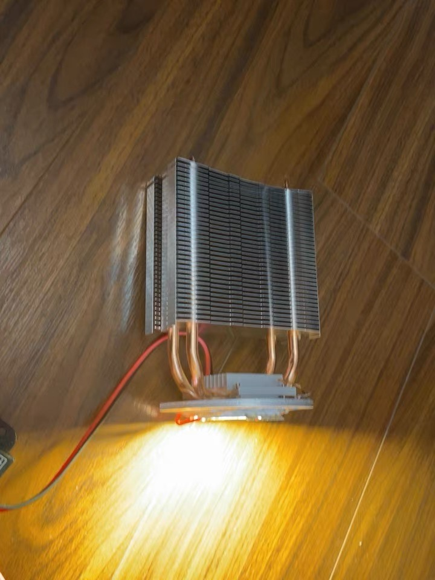
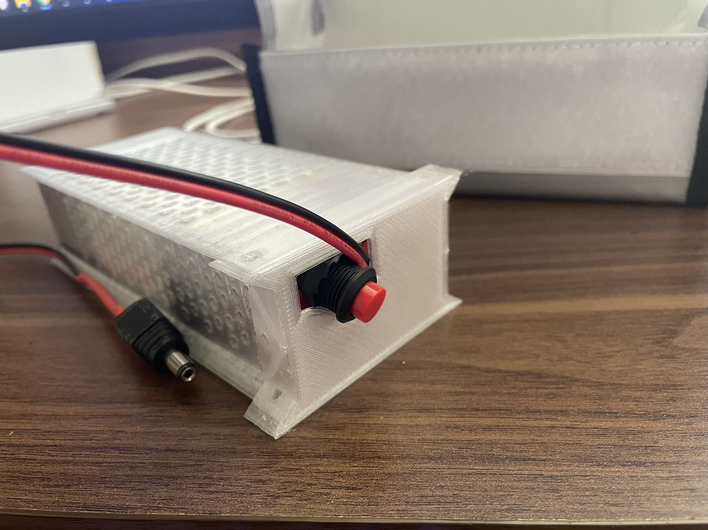
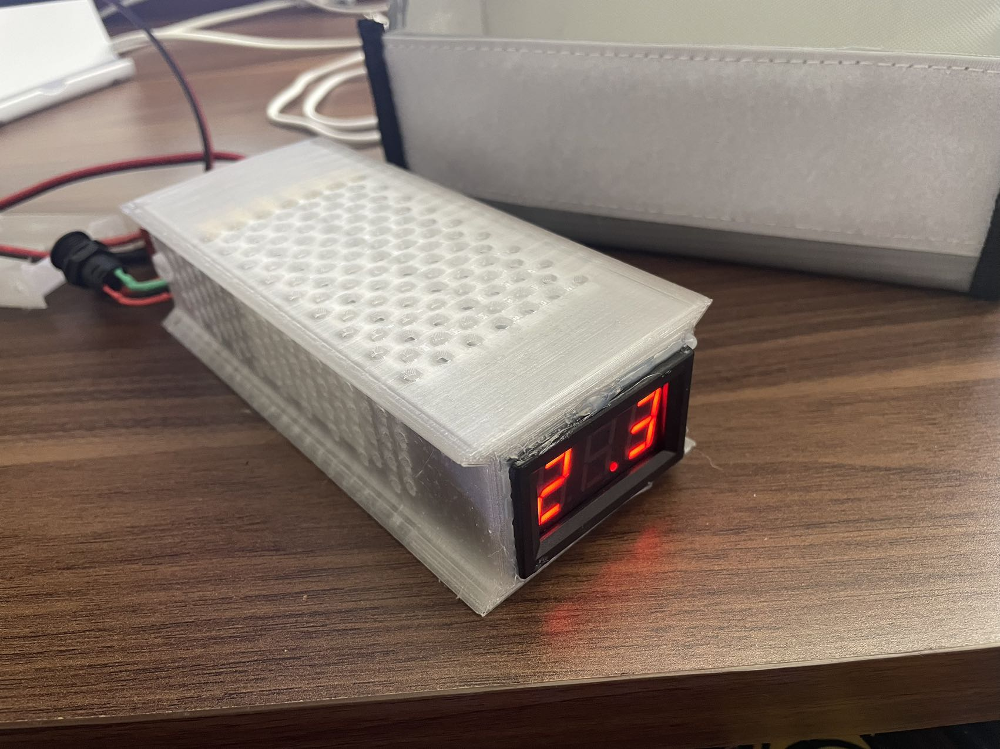

# DIY摄影灯

摄影市场长期处于被“卖铲子”的人割韭菜的问题，为了支持老婆大人的摄影事业，充分利用现有设备，降低设备成本，于是DIY了这个摄影灯，包含外带的电池包，需要额外购买以下的产品并使用3D打印机打印灯具和电池的保护外壳，购买材料如下：
- 24V LED集成灯珠 50W/￥13.8，100W/￥19，如果需要高显色指数的，成本可能会提高2倍，根据个人需求来。

- LED调光驱动 PWM LED 亮度调节器（DIMMER） ￥13（其中快递费￥4）		
这东西需要把里面的板子拆出来安装，减轻外壳重量，打印件也是根据拆出来的电源板设计的安装孔，这个是标准化的产品，所以外形一样的电源板尺寸也是一样的，先把旋钮拔下来，然后顺着把螺钉拆下来，就可以把主板取出来了。

- 电源按钮开关 直流带灯的 支持10A电流的，50W的LED大概在1.35A左右电流，如果要定制到200W，保险起见还是选支持10A电流的，我选的绿色的灯，看起来很有科技感 ￥8

- 散热器 这个相当关键，没有散热器的LED灯珠最多支撑3S可能就过热烧炸了，所以一定要配上散热器，这里我选择的是没有风扇的，风扇单独购买。 ￥30
		
图片是我随便找的，尺寸不对，我们这里选择9cm尺寸的，方便塞到壳子里面。
- 散热风扇 24V 9cm*2.5cm。50W的LED发热量不是很大，十分钟以内散热器都感觉不到热量，所以理论上可以不选配风扇。￥3（包邮你敢信，我都不知道现在这个生意这么难做，618我还领了个券，最后￥0.01到手的） 		
风扇一定注意是24V的，我们的电池和电源选配的都是24V的，所以一定要注意。理论上风扇可以接到调光器的输出端，实现和LED亮度匹配的转速，但是我买的风扇在低转速下有严重的啸叫声，我就直接接到按钮开关的次级，和调光器同一级了。

- 电线、嵌入式铜螺母M3*5*5、螺钉M3若干

- 5.5母座1个

- 24V 3A电源，我这里考虑后续最多供100W的灯，如果需要加大瓦数，需要更换电源。 ￥14

		
电线和插头我利用家里现有的，就没有计入成本了，这样算下来购买三方材料的费用在￥81.8左右（50W灯），算上3D打印的材料费大概￥14，插电版的成本在￥95.8，可以说是相当便宜了。
### 半成品预览

### 成品预览
- [ ] Todo

## 打印文件说明
- front_cover.STL 和LED灯连接的前盖
- middle_cage.STL 中框，主要是容纳散热器以及安装调光器和电源插头的
- back_cover.STL 背板，主要是安装电源按钮的

## 电池外壳说明
电池我使用的是我的2.2A 30C的航模电池，价格比较昂贵（￥115/22.2V 6S;2200mA 30C+￥106/6S 平衡充电器），实际购买的时候只需要有2.2A 2C以上即可承载4A左右的电流了（2.2*2)。使用这么大的电源是因为本来外带的需求不是很高，航模电池一方面平时装机器人上面用，外出的时候借给我老婆装灯上用了，算是充分利用剩余价值。
- battery_cage.SLDPRT 电池防滚架，长度我设计得比较长，可以在尾部装一个电压显示仪，随时观看，防止电池过放，或者自行塞一个尺寸合适的“BB响”（之前一直不知道有这玩意儿，一直是看电压，上次买电池的时候那个老板特别细心，还打电话过来问我要不要配个BB响，我说这玩意儿是个啥，名字好奇怪，而且老板是个广东人我第一时间听到“BB响”想到的是他们叫小孩子的BB仔，哈哈^o^）
- battery_cover.STL 电池盖，挖了个孔，方便把线拽出来

